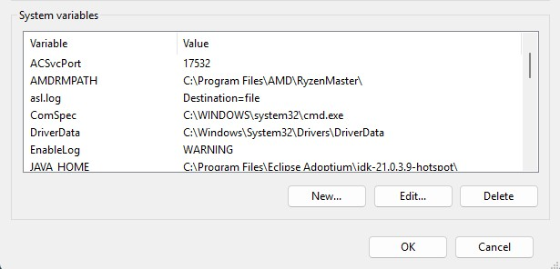
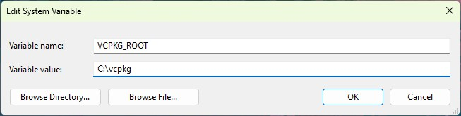

# Valorant-Vision

# Fork Contributors
- Jackson Johnson
- Preston Morgan
- Jorgan Petit
- Luisa Quintero Pineda
- Diyar Tahir

# FOR LINUX (Debian/Ubuntu)

## Requirements
- An editor such as VSCodium
- CMake (Source Distribution)

  `https://cmake.org/download/`
- OpenCV

  `sudo apt update`

  `sudo apt install build-essential cmake libopencv-dev`
- QT

  `sudo apt install qt6-base-dev qt6-declarative-dev qt6-multimedia-dev libqt6multimediawidgets6`

## Running Software

- Make sure you are in the Valorant Vision Folder Directory
  
1. `cmake ..`

2. `make -j$(nproc)`

3. `./Valorant-Vision`
  
  

---
# FOR WINDOWS

## Requirements

### Windows Build Requirements
- Visual Studio 2022 (Community Edition) 
  - Install the following workloads:
    - Python development
    - Desktop development with C++

- vcpkg
  - From the terminal application on Windows, run the following commands:
    - `cd C:\` 
      - //Note: You can install vcpkg anywhere, but I recommend C:\ for simplicity.   
    - `git clone https://github.com/microsoft/vcpkg.git`
    - `cd vcpkg`
    - `.\bootstrap-vcpkg.bat`
  - That's it! vcpkg is now installed and ready to use.
  
- Qt: https://www.qt.io/development/download-qt-installer-oss
  - Download the Qt installer and run it
     - Select 'Qt 6.11.2 for desktop development' AND 'Custom Installation'
     - Ensure the following components are selected:
        - Qt 6.11.2
        - MSVC 2022 64-bit
        - Additional libraries
  - Example installation path:  
    `C:\Qt\6.11.2\msvc2022_64`

- OpenCV: https://opencv.org/releases/
  - OpenCV 4.14.0 (Note: 5.x.x is not supported at this time)
  - Example path:  
    `C:\opencv\build\bin`
 
- Cmake Installed

## Environment Variables

## PATH Additions (User Variables)
Press Windows Key and search `edit environment variables for your account`

Select `Environment Varaibles` option below Startup and Recovery.

Add the following paths to the highlighted option in the image:

AFTER DOUBLE CLICKING ON Path!!
  - //Note: If you installed Qt or OpenCV somewhere else, use that path instead. 
  - `C:\Qt\6.11.2\msvc2022_64\bin`  
  - `C:\opencv\build\bin`
  - `C:\[FILE PATH TO Valorant-Vision]\Valorant-Vision\build\vcpkg_installed\x64-windows\bin` 
    - //Note: I'll find a better way to handle the line above later, but for now this is how I got it to work.

Create new environment variable:
  - Variable name: `QT_PLUGIN_PATH`
  - Variable value (Example): `C:\Qt\6.11.2\msvc2022_64\plugins` 
    - //Note: If you installed Qt somewhere else, use that path instead.

Click 'New...' under 'System Variables':

Create new system variable:
  - Variable name: `VCPKG_ROOT`
  - Variable value (Example): `C:\vcpkg` 
    - //Note: If you installed vcpkg somewhere else, use that path instead.

## To make the Build
In Visual Studio's 'Developer Powershell'; make sure you're in the `\Valorant_Vision` directory and run the follwing commands:
  - `vcpkg new --application`: Creates a `vcpkg.json` file in the current directory
  - These commands will add the following dependencies to your `vcpkg.json` file:
    - `vcpkg add port eigen3`
    - `vcpkg add port tesseract`
    - `vcpkg add port nlohmann-json`
    - `vcpkg add port onnxruntime`

  - Close and reopen Visual Studio and wait for cmake to finish configuring the project. This will take a long time the first time around, but once it's finished you should see a message in the output window that says "Configuring done".
  - Once cmake is done configuring, you can build the project by running the following commands:
    - //Note: The next two commands for building the project will take a long time the first time around, possibly 30 minutes or more depending on your system.
    - `cmake -S . -B build`: Generates the build files in the `\build` directory
    - `cmake --build build --config Release`: Compiles the project and creates the executable in the `\build\Release` directory

If you need to rebuild or make the build again; before building run the following command in the `Developer Command Prompt` to delete the previous build:  
`rmdir /s /q build`

## Running Valorant-Vision.exe
Open the `\build\Release` directory in File Explorer and double click on `Valorant-Vision.exe` to run the program.

# For MacOS

## Requirements

